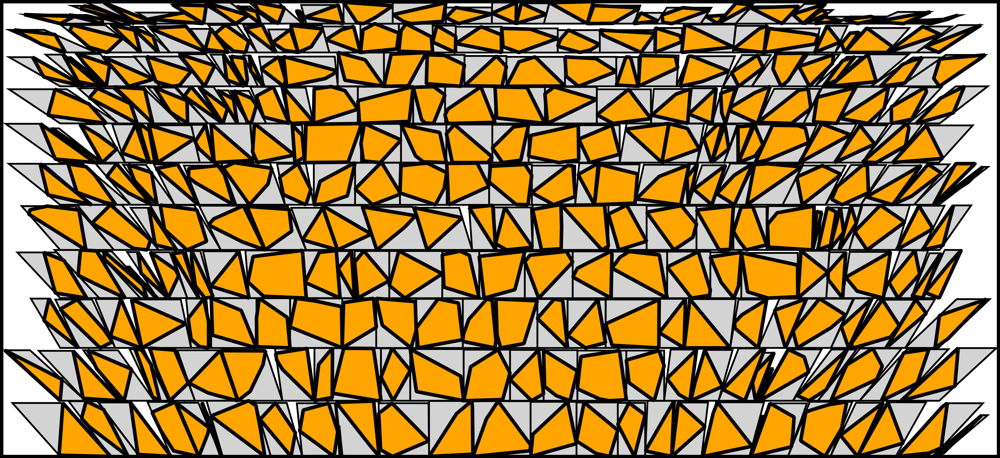

# Tight Packing of Convex Polygons

## Introduction

Optimal packing of objects in containers is a fundamental problem with extensive real-life and industrial applications. The act of efficiently packing a collection of objects into a designated container manifests in various everyday scenarios, such as fitting items on a shelf or arranging cookies on a baking tray.

This project specifically dives into the packing of (two-dimensional) convex polygons, a problem arising in many industries. Whether it's cutting shapes from rolled-out dough, manufacturing tile sets from standard-sized wooden, glass, or metal panels, or tailoring fabric pieces for clothing that need to maintain a specific pattern, the challenges of packings of polygons are ubiquitous.

The vast applicability of 2D packing has driven significant interest in the development of efficient algorithms. This repository presents and demonstrates the main algorithm from the research paper titled "[Improved Approximations for Translational Packing of Polygons](https://drops-beta.dagstuhl.de/entities/document/10.4230/LIPIcs.ESA.2023.76)," co-authored by Adam Kurpisz and me, presented at the European Symposium on Algorithms (ESA) in 2023. The results in this paper were the culmination of my Master's thesis research at ETH Zurich.

## Problem Statement

Our focus is on packing convex polygons without rotations in various settings. The aim was to design algorithms that are both fast and accurate, given the inherent complexity of such packing problems.

More formally, the problem is the following. Given an instance $I$ of convex polygons $p_1, \dots, p_n$, all of them are being defined as a list of their vertices. The goal is to find a translational packing of $I$ (i.e. locations of the polygons in $\R^2$ so that none of them are overlapping) for which the axis-parallel, rectangular bounding box has minimal area.

A key thing is that we want to have an efficient algorithm (i.e. one with polynomial running time). Since no algorithm with polynomial running time exists unless P=NP, we focused on getting a best-possible approximation guarantee (which describes how good the algorithm works in the worst case).

## Overview of the Repository

- The introduced algorithm runs efficiently and offers an approximation guarantee of 9.45, reducing the approximation guarantee drastically from the previously known guarantee of 23.78 (see [this paper](https://jocg.org/index.php/jocg/article/view/3116/2854) by Alt, de Berg and Knauer).
- This work builds upon the foundation of existing algorithms for the packing of axis-parallel rectangles, which are often called shelf-packing algorithms. See [NFDH or FFDH](https://en.wikipedia.org/wiki/Strip_packing_problem) for examples of such algorithms, that produce packings of axis-parallel rectangles by packing them onto shelves.
- In 'rectangle_packing.py', one can find implementations of both Next Fit Decreasing Height (NFDH) and First Fit Decreasing Height (FFDH), which are used as a subroutine for our main algorithm.
- Our main algorithm can be called with the function 'polygon_packing' in 'polygon_packing.py'.
- To visualize the computed packing, the functions in 'plotting' can be used.

## Visual Demonstration



## Installation and Usage

### Prerequisites

Before you can run the code, ensure you have the following prerequisites set up:

- **Python:** You should have Python (version 3.x) installed. If not, [download and install](https://www.python.org/downloads/) it.
- **Virtual Environment** (optional but recommended): Using a virtual environment ensures that the dependencies for this project won't interfere with other projects you might have. You can set one up using `venv`:

```bash
python -m venv myenv
source myenv/bin/activate  # On Windows, use `myenv\Scripts\activate`
```

### Setup

Follow the steps below to obtain the code and set it up:

1. **Clone the Repository:**
   
```bash
git clone https://github.com/your_username/your_project_name.git
cd your_project_name
```

2. **Install Dependencies:**
   
Make sure to install all packages as specified in requirements.txt:

```bash
pip install -r requirements.txt
```

### Running the Code

Here's how you can run the application:

- **Running the Algorithm:**

The main algorithm can be run using the function 'polygon_packing' in 'polygon_packing.py'. The polygons (with or without bounding parallelograms) can then be plotted with the function 'visualize_polygons' from 'plotting.py'.

See the file demo.ipynb for a demonstration on how to use the algorithm.

## Performance Metrics

When using First Fit Decreasing Height as a subroutine, the algorithm achieves a 9.45 approximation guarantee for the area minimization problem. That is, for any instance of convex polygons, the algorithm is guaranteed to give a packing which has at most 9.45 times the area of the best possible packing. This is the best proven approximation guarantee of any polynomial-time algorithm to date. Of course, for most instances, the algorithm perform much better than that.

The algorithm runs in $\mathcal{O}(f(n) + N)$ time, where $N$ is the total number of vertices of all polygons and $f(n)$ is the running time of the rectangle shelf packing algorithm used as a subroutine dependent on the total number of polygons $n$. For FFDH, $f(n) = n^2$ and for NFDH, $f(n) = n \log(n)$.

## Planned Features

It is planned to add a python notebook file to take the reader through the problem and the algorithm in an easy to understand manner. Until then, the reader is referred to the [paper](https://drops-beta.dagstuhl.de/entities/document/10.4230/LIPIcs.ESA.2023.76).

## Possible Improvements

The algorithm is optimized for a best possible approximation guarantee, thus guaranteeing that the algorithm will not perform too badly for any instance. By possibly worsening this approximation guarantee it is very well possible to obtain better heuristic performance using one of the following methods.

- Picking another shelf-packing algorithm than NFDH or FFDH as a subroutine.
- Skipping the packing of rectangles entirely as follows.  We describe a NFDH-like variant of directly packing the polygons. Similarly, one could implement an FFDH-like variant. Still, for every polygon, we compute its bounding parallelogram. Now we order all the polygons by height. One by one, we consider the polygons (as NFDH does). We fit a currently considered polygon into the uppermost shelf, where its position in the shelf is determined by a side of the parallelogram (which is either parallel to the spine of the polygon or to the y-axis, depending on the polygon). The polygons in that shelf which are on the right of this newly packed polygon are then moved to the right, so far so that the currently considered polygon exactly fits in its place. If the polygons in this shelf now exceed the prespecified width of the packing, we restore the state before packing this new polygon, and pack the polygon in a new shelf to the very left instead.
The described procedure would need more time to run (i.e. $\mathcal{O}(n N \log(N)$ time for the NFDH-like algorithm and $\mathcal{O}(n^2 N \log(N)$ time for the FFDH-like algorithm). Hereby the term $N \log(N)$ comes from tightly packing together polygons that are on the same shelf (see page 7 in the [paper](https://jocg.org/index.php/jocg/article/view/3027) by Alt, de Berg and Knauer).

## Licensing

This project is licensed under the MIT License. This allows others to use, modify, and distribute this software without restriction.

For full details, please see the [LICENSE](./LICENSE) file in the repository.

## Acknowledgments

Special thanks to Adam Kurpisz for co-authoring the research paper and to ETH Zurich for providing the platform for this research.
